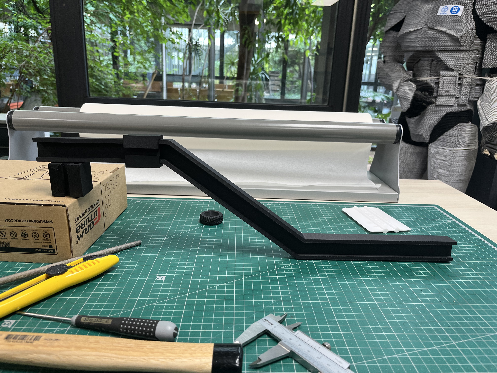
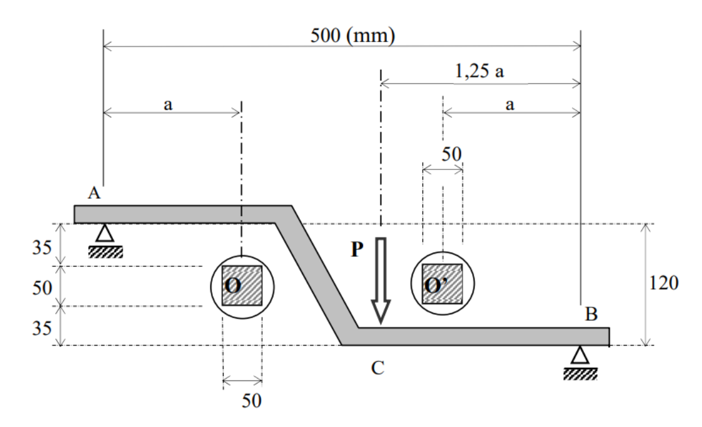
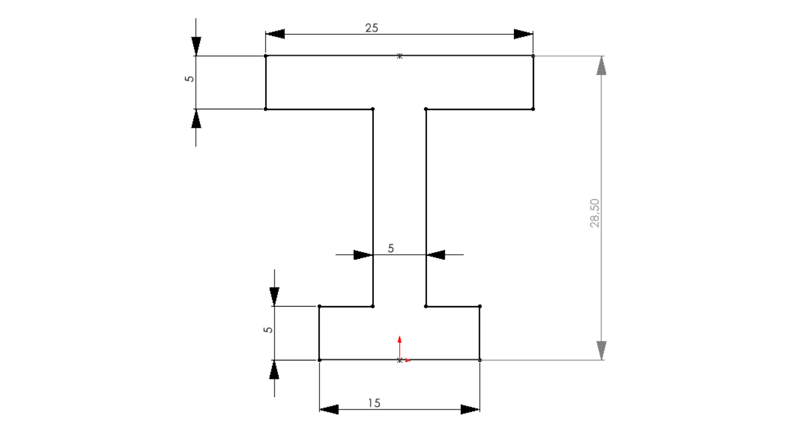
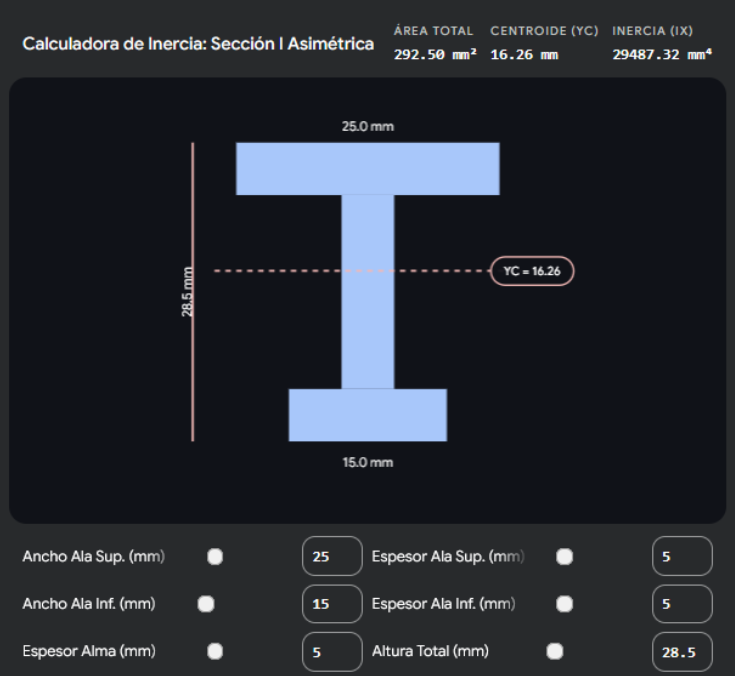
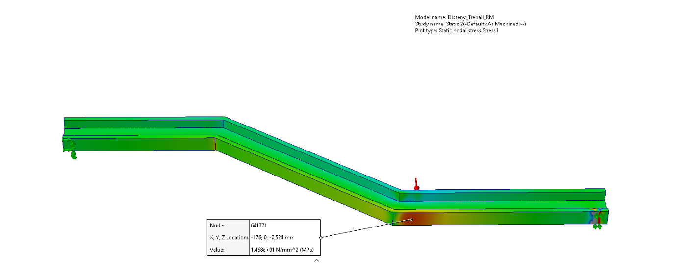
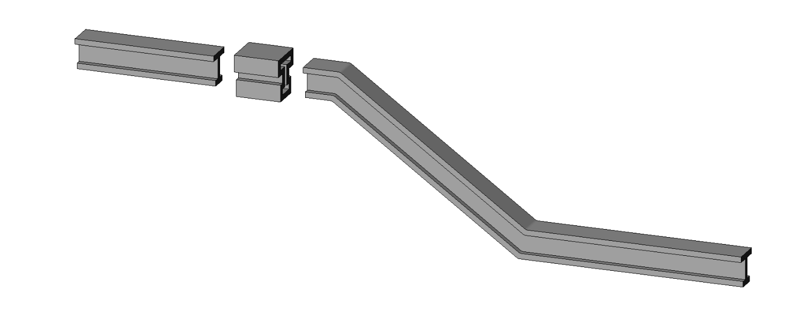
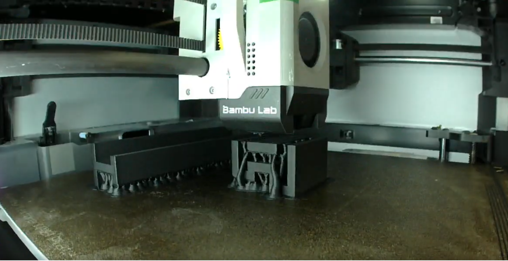
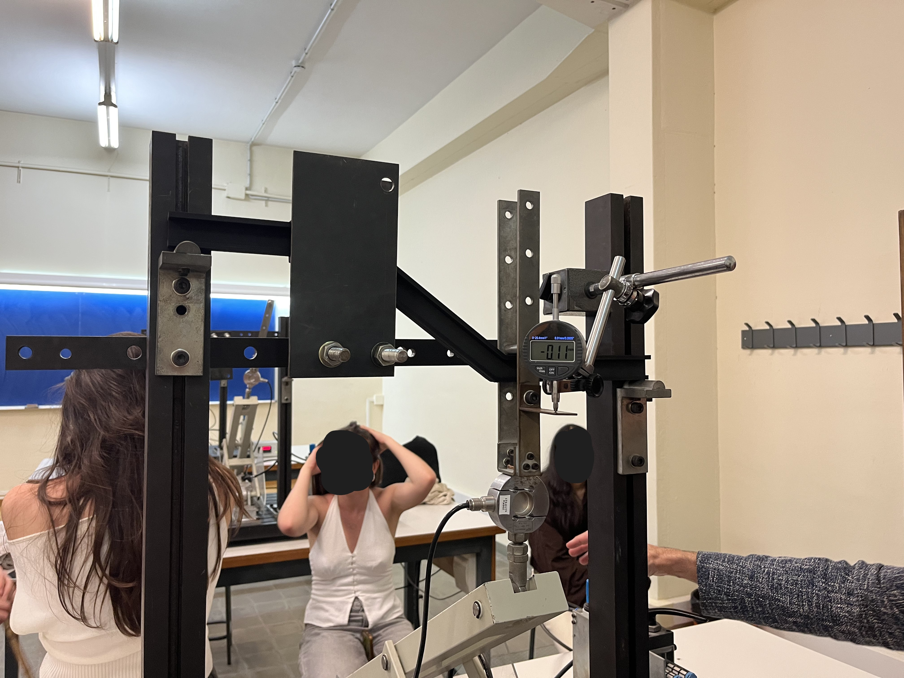
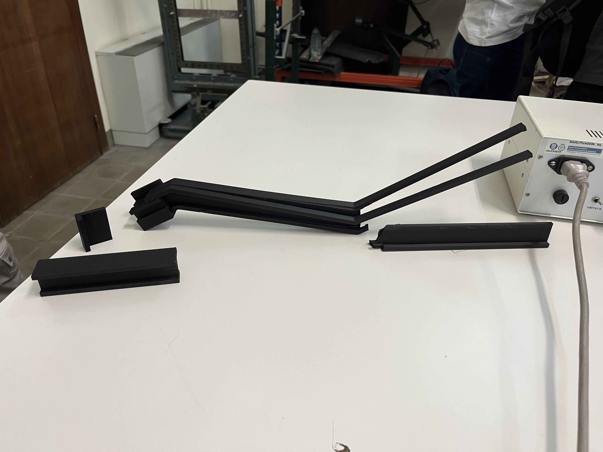

# Design-Fabrication-and-Testing-of-a-3D-Printed-PLA-CF-Beam

For this university project the goal was to design and build a 500 mm stepped beam that had to carry 250 N past two obstacles with a safety factor between 1.5 and 2.5. We sized it analytically, checked it with FEA, printed it in carbon-fibre-filled PLA, and loaded it to failure. The measured deflection at nominal load (6.74 mm) fell between the FEA (6.13 mm) and analytical (7.26 mm) predictions, and the beam fractured at 739 N: 2.96 times the nominal load and above the 617 to 647 N we had predicted.

### The brief

* Simply supported beam, 500 mm between supports, 250 N nominal load applied 168.75 mm from the lower support (positions and load assigned to our group: a = 135 mm, F = 250 N).
* Must never touch two obstacles (20 mm initial clearance at the tightest point).
* Safety factor between 1.5 and 2.5, deflection under 15 mm anywhere, width up to 35 mm, no straight segment over 400 mm, at least 10 mm of contact length at supports and load point.

### Design decisions

**Centerline**. We compared a shallow 35.5° diagonal against a 90° step. Both give the same critical bending moment (27.95 N·m, at the load point), so the decision came down to gentler direction changes (less stress concentration) and material: for the same section, the diagonal needs about 13% less volume (163 vs 187 cm³).

**Material**. Using Ashby charts (stiffness, strength and cost against density), we ruled out pine (too weak for its density) and steel or aluminium (more cost, more lead time, dependence on an outside workshop). We chose Bambu Lab PLA-CF (ρ = 1.22 g/cm³, E = 2790 MPa, 38 MPa yield strength in the print plane) over plain PLA for notably better stiffness and strength at nearly the same density. Because it is brittle and its tensile and compressive strengths differ, we used Rankine's criterion. The datasheet gives no compressive strength, so we estimated 43.7 MPa (15% above tensile) from a published study.

**Cross-section**. Three iterations:

1. A modified L-profile (20x3 mm with a tie) was dropped after feedback from teacher: its shear centre does not sit on the load line, which would add unwanted torsion.
2. Rotating it to fix that cut the moment of inertia to under a third, so it was dropped too.
3. The final section is an asymmetric I-beam, 28.5 mm tall (25x5 mm top flange, 15x5 mm bottom flange, 5 mm web): A = 292.5 mm², I = 29,487 mm⁴, W = 1,813 mm³, over 3 times the section modulus of the first concept. We sized it with a small calculator we built for centroid and inertia, aiming for a safety factor as close as possible to the 2.5 upper limit (the lightest allowed design).

### Verification

* Internal force diagrams located the critical section at the load point (M = 27.95 N·m).
* Stresses at five points of that section (two extra on the lower flange, since both section and material are asymmetric), then principal stresses and Rankine safety factors. Governing case: bottom fibre in tension, 15.4 MPa, safety factor 2.47.
* Deflection with Castigliano's theorem (axial, shear and bending terms), plus a fictitious-load variant for the point closest to the obstacle: 6.25 mm of deflection against a 20 mm gap, so a predicted 13.75 mm margin.
* SolidWorks FEA cross-check: peak stress 14.7 MPa (4.7% below analytical, safety factor 2.59) and deflection at the load point 6.13 mm (about 16% below analytical).

### Fabrication

* Printed in ETSEIB's EngiLab on a Bambu Lab H2D (FDM). The 520 mm beam did not fit the 320x325x350 mm build volume, and outsourcing pushed the print cost above 50 € (under 10 € in-house).
* We split the beam into two segments (395 mm and 115 mm of horizontal length) joined by a printed sleeve with the same I-profile and 0.1 mm clearance for a push fit. The joint sits where stresses are well below those at the critical section.
* Printed flat in the X-Y plane so there are no significant stresses perpendicular to the layers, where FDM parts are weakest (layer separation). Print settings came from an earlier design-of-experiments study on the flexural strength of printed specimens, done by two team members in a statistics-for-quality course.
* Total cost: 19.25 € (6.42 € per person): 15.25 € for our group's share of the filament spool and 4 € for two prints. The report also covers environmental impact.

### Testing

The beam was tested on a lab rig with a load cell and a digital dial indicator (0.01 mm resolution) at the load point. We loaded it to the 250 N nominal load, then to 655 N (just above the predicted ultimate load), then to failure.

<table>

&#x20; <thead>

&#x20;   <tr>

&#x20;     <th></th>

&#x20;     <th>Analytical</th>

&#x20;     <th>FEA</th>

&#x20;     <th>Measured</th>

&#x20;   </tr>

&#x20; </thead>

&#x20; <tbody>

&#x20;   <tr>

&#x20;     <td>Deflection at load point, 250 N</td>

&#x20;     <td>7.26 mm</td>

&#x20;     <td>6.13 mm</td>

&#x20;     <td>6.74 mm</td>

&#x20;   </tr>

&#x20;   <tr>

&#x20;     <td>Peak tensile stress, 250 N</td>

&#x20;     <td>15.4 MPa</td>

&#x20;     <td>14.7 MPa</td>

&#x20;     <td>n/a</td>

&#x20;   </tr>

&#x20;   <tr>

&#x20;     <td>Safety factor (38 MPa limit)</td>

&#x20;     <td>2.47</td>

&#x20;     <td>2.59</td>

&#x20;     <td>n/a</td>

&#x20;   </tr>

&#x20;   <tr>

&#x20;     <td>Ultimate load</td>

&#x20;     <td>617 N (predicted)</td>

&#x20;     <td>647 N (predicted)</td>

&#x20;     <td>Fracture at 739 N</td>

&#x20;   </tr>

&#x20; </tbody>

</table>

The 6.74 mm figure is the reading at 250 N minus the 0.11 mm initial offset of the dial (raw reading 6.85 mm). Deflection then grew in proportion to load: 17.74 mm at 655 N and 20.09 mm at 739 N, with less than 1% change in compliance (mm per N) from 250 N to fracture. Fracture was abrupt and occurred at several locations, as expected for a brittle composite.

### 

### What we took from it

* **Optimised sections converge on standard ones**. Our custom section ended up close to a standard I-beam, so tabulated profiles are usually the efficient choice.
* **Manufacturing drove the architecture**. The printer's build volume, not the mechanics, forced the split beam and joint design. Manufacturing limits belong in the first design step.
* **Cross-checking two models paid off**. Analytical and FEA stresses agreed within 5%, and the measured deflection fell between the two deflection predictions.
* **The design was conservative**. Failure at 739 N is 14 to 20% above the predicted ultimate load. A back-calculation from the linear response puts the peak tensile stress at fracture at roughly 43 to 46 MPa, against the 38 MPa datasheet value used for design.
* **Limits of the work**. The compressive strength was estimated from literature, not tested. The test instrumented load and load-point deflection only, so obstacle clearance rests on the calculated 13.75 mm margin.

**Skills and tools**: structural analysis (internal forces, Navier and Rankine, Castigliano), FEA and CAD in SolidWorks, material selection with Ashby charts, design for FDM, PLA-CF printing, experimental testing and model validation, cost analysis.

